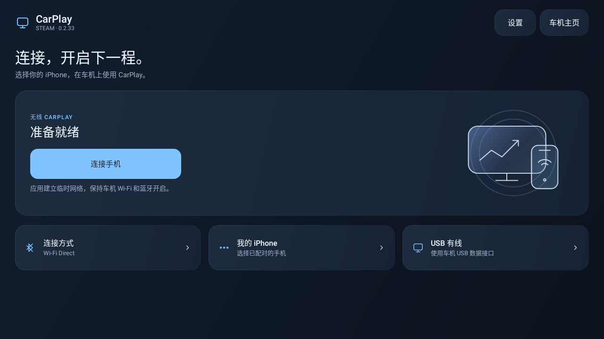

# CarPlay 0.2.33 · Steam

本版修复画面资源释放竞态和导航音频收尾检查，减少音视频分配与界面绘制开销，统一应用界面并重新分组设置。音乐默认缓冲保持 **100 ms**。完整说明见 [0.2.33 界面与流畅度改进](CARPLAY-0.2.33-UI-AND-SMOOTHNESS.md)。

## 下载与安装

- [下载 CarPlay 0.2.33 APK](https://github.com/SOLHK/CarPlay/releases/download/v0.2.33/CarPlay-0.2.33.apk)
- [下载完整源码与测试报告](https://github.com/SOLHK/CarPlay/releases/download/v0.2.33/CarPlay-0.2.33-source-and-tests.zip)
- [发布说明与 SHA-256 校验文件](https://github.com/SOLHK/CarPlay/releases/tag/v0.2.33)

安装包为 `com.shihab.diplay.steam.hudtest`，版本 `0.2.33-ui-test`，最低 Android 9。APK 包含连接认证，使用此前测试版的同一签名，可直接覆盖此前测试版并保留设置。请安装到车机。

源码保留上游许可与说明；独立构建需要按 [构建指南](docs/BUILD.md) 提供外部认证输入。APK 校验结果与 1062 项测试报告见 [验证记录](validation/0.2.33)。

安卓手机 / 车机接收屏定制版，基于下述 DiPlay 开源项目。0.2.32 移植的连接、视频、Siri、通话和比亚迪功能继续保留，细节见 [0.2.32 功能说明](CARPLAY-0.2.32-SELECTED-FEATURES.md)。

本版已通过编译、Android 单元测试及 Robolectric 原生图形渲染检查；尚未进行车机 / iPhone 实际连接或帧率测试。以下保留上游项目历史说明，历史实车结果不代表本版实测。

## 上游 DiPlay 原始说明（历史归档）

**CarPlay for compatible BYD Android head units.** Wired and wireless, with the familiar DiAuto interface. Independent app: `com.shihab.diplay.steam`.

> **BYD support scope:** These projects focus on BYD cars. They may work on other brands, but other brands are unsupported and there are no plans to add support or fix brand-specific incompatibilities.

[Download & website](https://shihabal3amri.github.io/DiPlay/) · [Release](https://github.com/shihabal3amri/DiPlay/releases/tag/v0.2.11) · [Report a problem](https://github.com/shihabal3amri/DiPlay/issues/new/choose)

## 0.2.11 — public preview

Install on the **car**, not the iPhone. No jailbreak, dongle, Mac, account or authentication server is required for use. Core CarPlay does not require ADB; optional dashboard, battery, wheel-speed and parked-video features do. Your head unit must permit APK installation. Wireless supports Wi-Fi Direct or the car’s existing hotspot; Wi-Fi Direct requires Android 10+; the APK supports Android 9+ for wired use.

- Wired USB and wireless CarPlay with local authentication.
- BYD HUD navigation with arrows, distance and street names on verified firmware.
- Car hotspot support, improved audio buffering and saved receive diagnostics.
- Automatic address discovery, fixed-channel Wi-Fi fallbacks and successful-configuration memory.
- Icon/text size, resolution and frame rate; applying a display change reconnects CarPlay.
- Local diagnostic export. Reports are sent only if you choose to share them.
- Separate installation alongside DiAuto. Run one projection app at a time.

This is **not an Apple-certified product**. The APK bundles an experimental accessory identity recovered from public Carlinkit firmware, not a newly provisioned MFi identity for DiPlay. A bundled private key is extractable. Acceptance after future iOS updates, reliability across head units and suitability of that identity for general distribution are unresolved. This release invites community testing; it is not a guarantee of universal compatibility.

Earlier releases were tested on the development DiLink5.1 car: live windshield guidance and street names work, Car hotspot now starts CarPlay, and Wi-Fi Direct performance is substantially improved. Occasional audio cutouts remain and are deferred to a later update. The floating-map test build was installed on the development DiLink 5.1 car; feedback led to the pinch corrections in 0.2.9. Earlier wheel-speed and video contributions were tested on a BYD Tang with DiLink 5.0 and an iPhone 15 Pro on iOS 27; wheel-speed dead reckoning in tunnels remains unverified. Broader head-unit and iOS compatibility is not guaranteed. The HUD firmware scope and cleanup limits are documented in [BYD navigation](docs/BYD_NAVIGATION.md).

## What’s new in 0.2.11

- **Preferred Wi-Fi Direct channel**: Auto remains the default; save a supported 2.4/5 GHz channel for the next connection. Rejected or mismatched manual channels report an error. Channel choice is not a confirmed stutter fix.
- A custom dashboard turn card with size choices and position changes in 2% steps. Unknown maneuvers show no guessed arrow; expired guidance clears.
- Two-, three- or four-finger settings swipes, keeping three as the default, plus Android TV/remote controls that preserve ordinary touch and knob behavior.
- Opt-in read-only legacy vehicle-data detection under Location → Advanced vehicle data. Default DiLink 5.0 mode remains the default; only accepted fields/readings become runtime data. Stale-probe and battery-publication concurrency corrections are included.
- Optional automatic startup of the existing car hotspot, off by default, with verified permissions limited to DiPlay's own package.
- Wireless location/vehicle data on the runtime Wi-Fi link and parked-video availability delivered after SETUP/event-channel readiness. Non-P or unreadable gear still closes video.
- Retain artists across partial song updates and publish media-session metadata/artwork only when changed; position/play state keep updating.
- Android 9 audio API compatibility, failed-codec cleanup, settled-size/readiness checks after reconnect, an exact-error Android 10 P2P compatibility path in Auto mode, and a wired VPN restricted to DiPlay.
- Bounded wireless/media/theme and own-app exit diagnostics, without audio/video/packet payload recording or automatic uploads.

Optional legacy vehicle data, battery, wheel speed and parked video require authorized network ADB and supported readings. Dashboard, hotspot and audio effects depend on firmware and Android support. See [0.2.11 release notes](docs/RELEASE-NOTES-0.2.11.md) and [validation](docs/VALIDATION.md) for review corrections and device-test limits. Qin Plus startup, Wi-Fi Direct stutter, Siri/microphone quality, iOS 15 connection and day/night firmware reports still need fresh hardware evidence.

If a problem remains, reproduce it on **0.2.11**, then use **Settings → Diagnostics → Save diagnostic report**. Android 10+ saves to **Downloads/DiPlay**; Android 9 uses the document picker. Review the `.txt` file and attach it to your existing [issue](https://github.com/shihabal3amri/DiPlay/issues), including vehicle/firmware, phone/iOS, connection mode, steps and failure time. Reports are shared only when you choose; never post your hotspot password.

## Documentation

- [Install and connect](docs/INSTALL.md)
- [Compatibility and troubleshooting](docs/COMPATIBILITY.md)
- [Privacy and diagnostic reports](docs/PRIVACY.md)
- [Build from source](docs/BUILD.md)
- [Validation](docs/VALIDATION.md)
- [Release notes](CHANGELOG.md)
- [Credits and licenses](docs/THIRD_PARTY_NOTICES.md)

The website is available in English, Arabic, Russian, Ukrainian, Spanish and Simplified Chinese. The app interface supports those same six languages. Choose the app language in Settings; on Android 13+, it stays synchronized with Android’s per-app language setting.

## Source and credits

Based on [xcertplay](https://github.com/shilapi/xcertplay), GPL-3.0. The home/settings UI and website adapt [DiAuto](https://github.com/shihabal3amri/DiAuto), AGPL-3.0; that license is included in `docs/licenses`. Preserve those notices when distributing modifications. CarPlay and its icon belong to Apple Inc.; no Apple or BYD affiliation or endorsement is implied.

This repository starts with a clean public source snapshot. Local research, tester reports and release-signing secrets are excluded. The complete source corresponding to the APK is provided with every release; experimental runtime identity assets are described separately in the build instructions and notices.

## Local release packaging

The release APK intentionally contains the experimental accessory identity. The Git repository and source archive exclude all accessory and Android signing keys; tests generate synthetic identities at runtime. Source/CI builds omit runtime identity assets by default. Local release builds explicitly select an external asset directory. Publishing the APK makes its bundled identity extractable; building locally does not preserve that identity's confidentiality.
